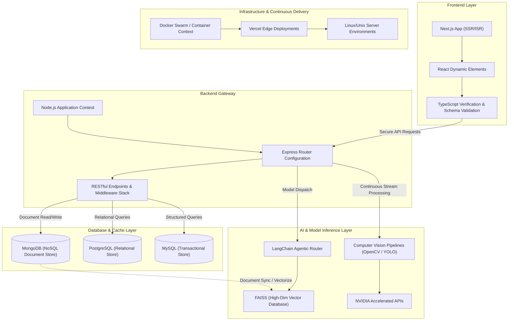
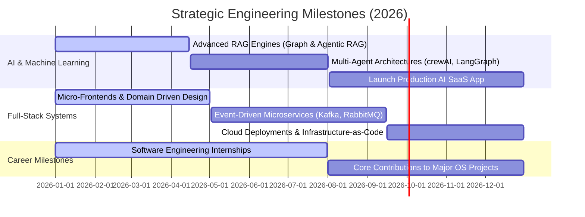

<!--
========================================================================
🔥 MONSTER GITHUB PROFILE README
👤 ENGINEER: Prakhar Shukla
🚀 ROLES: Full Stack Developer | AI Engineer | Software Engineer | Problem Solver
📅 LAST UPDATED: June 2026
========================================================================
Designed with ultra-premium typography, interactive elements, custom SVG banner animations,
Mermaid architecture maps, detailed project breakdowns, technical FAQs,
System Design Mastery Guides, CI/CD YAML configurations,
and high-impact corporate/startup recruitment alignments.
========================================================================
-->

<p align="center">
  
</p>

<p align="center">
  <a href="https://github.com/Iamprakharshukla">
    
  </a>
  <a href="https://www.linkedin.com/in/prakhar-shukla-74a9a6274/">
    
  </a>
  <a href="mailto:prakharshukla297@gmail.com">
    
  </a>
  <a href="https://github.com/Iamprakharshukla">
    
  </a>
</p>

---

# 🚀 Executive Brief

An ambitious **Full Stack & AI Engineer** bridging the gap between rigorous algorithmic problem solving and production-grade software architectures. Currently pursuing a **B.Tech in Computer Science & Engineering**, I architect responsive user interfaces, robust distributed backends, and context-aware Artificial Intelligence systems. 

Driven by a **Product Builder mindset** and a **Startup Founder mentality**, my focus is on engineering software that scales gracefully under heavy traffic, minimizes operational latency, and unlocks tangible business value.

### Key Focus Areas
*   **System Architecture:** Developing decoupled services and scalable schemas.
*   **AI Integration:** Building production RAG (Retrieval-Augmented Generation) systems, vector searches, and custom computer vision pipelines.
*   **Performance Optimization:** Refining rendering logic, API round-trip times, and database indexes.
*   **Problem Solving:** Applying deep mathematical and data-structure principles to algorithmic bottlenecks.

---

# 🧠 Engineering Mindset & Developer Philosophy

I believe that clean code is not a preference; it is a structural necessity. Software should be built to withstand scale, adapt to changing requirements, and remain highly maintainable for years.

<table width="100%">
  <tr>
    <td width="50%" valign="top">
      <h3>⚡ Building for Scale</h3>
      <p>Architecting systems from day one to support horizontal scaling, stateless session handling, and strategic caching layers. I write backends that degrade gracefully and recover automatically.</p>
    </td>
    <td width="50%" valign="top">
      <h3>🛠️ Write Maintainable Code</h3>
      <p>Clean abstractions, typed interfaces, and consistent design patterns over ad-hoc solutions. I advocate for robust CI/CD, strict testing coverage, and readable documentation.</p>
    </td>
  </tr>
  <tr>
    <td width="50%" valign="top">
      <h3>🎯 User-Centric Design</h3>
      <p>Great backends lose value without high-fidelity frontends. I build responsive, highly accessible, and micro-animated layouts that turn workflows into pleasant experiences.</p>
    </td>
    <td width="50%" valign="top">
      <h3>🤖 AI-Driven Innovation</h3>
      <p>Harnessing the power of Large Language Models, agentic orchestration, and computer vision models to solve tasks that were previously impossible with traditional code.</p>
    </td>
  </tr>
  <tr>
    <td width="50%" valign="top">
      <h3>📚 Continuous Learning</h3>
      <p>Technology shifts rapidly, but fundamentals remain constant. I continuously study database engines, operating system primitives, and state-of-the-art AI advancements.</p>
    </td>
    <td width="50%" valign="top">
      <h3>🤝 Open Source Credibility</h3>
      <p>Sharing library modules, fixing public bugs, and writing comprehensive technical guides. I believe that contributing to the global developer community strengthens the entire ecosystem.</p>
    </td>
  </tr>
</table>

---

# 🎯 Current Technological Focus (2026)

Currently deep-diving into production RAG pipelines and enterprise-grade microservice configurations. Here is a breakdown of what I am actively working on:

- **AI-Powered Applications:** Fine-tuning LLMs, building specialized agents, and integrating cognitive workflows into SaaS products.
- **Generative AI & RAG Architectures:** Optimizing retrieval latency with vector indexes, context-window compression, and hybrid search mechanisms.
- **Scalable Backends:** Transitioning monolithic backends into event-driven message architectures to optimize system throughput.
- **System Design & Patterns:** Researching distributed consensus algorithms, CQRS patterns, and horizontal database sharding.
- **Open Source Contributions:** Patching developer tools and sharing templates for Next.js AI setups.
- **Data Structures & Algorithms:** Maintaining a daily regime of competitive programming to sharpen optimization intuition.

---

# 🛠️ Technology Stack

A curated view of tools, frameworks, and programming languages that I use to turn ideas into scalable digital products.

### 🌐 Frontend Engineering
<p>
  
  
  
  
  
  
  
  
</p>

### ⚙️ Backend Engineering
<p>
  
  
  
</p>

### 🗄️ Databases & Storage
<p>
  
  
  
</p>

### 💻 Core Programming Languages
<p>
  
  
  
  
  
</p>

### 🤖 Artificial Intelligence & Computer Vision
<p>
  
  
  
  
  
  
  
  
  
</p>

### 🛠️ DevOps, Infrastructure & Tools
<p>
  
  
  
  
  
  
  
</p>

---

# 🏗️ Full-Stack System Architecture

Below is a structured flow showing how I typically map out modern full-stack web platforms. This diagram illustrates separation of concerns across a standard client-server-database-model lifecycle.



---

# 🚀 Featured Project Showcase

A collection of selected applications displaying architectural decisions, technology integration, and real-world business impacts.

<table width="100%">
  <tr>
    <!-- Project 1: Nexora AI -->
    <td width="50%" valign="top">
      <h3>🚀 Nexora AI</h3>
      <p><strong>AI-Powered E-Commerce Operating System</strong></p>
      <p>Nexora AI bridges the gap between traditional retail and machine-guided insights, offering a suite of intelligent automation features.</p>
      <p>
        
        
        
        
      </p>
      <ul>
        <li><b>Predictive Engine:</b> Personalizes listings using neural collaborative filtering algorithms.</li>
        <li><b>Semantic Search:</b> Implements high-dimensional vector embeddings for intuitive queries.</li>
        <li><b>AI Assistant:</b> Embedded chatbot managing multi-step shopping journeys.</li>
        <li><b>Real-Time Analytics:</b> Monitors transactional metrics, tracking stock levels.</li>
      </ul>
      <p>💡 <i>Business Impact: Boosts user conversion rates and automates shop administration.</i></p>
    </td>
    <!-- Project 2: People Counting System -->
    <td width="50%" valign="top">
      <h3>🤖 People Counting System</h3>
      <p><strong>AI-Powered Crowd Monitoring Platform</strong></p>
      <p>An enterprise-grade real-time security tool capable of object classification and localized crowd density estimation.</p>
      <p>
        
        
        
        
      </p>
      <ul>
        <li><b>Real-Time Parsing:</b> Deep CNN-based target detection under 20ms frame latency.</li>
        <li><b>Tracking Logic:</b> OpenCV optical flow trackers monitor individual directions.</li>
        <li><b>Security Alerting:</b> Sends automated alerts when occupancy safety thresholds are breached.</li>
        <li><b>Telemetry Logs:</b> Generates visual flow diagrams of high-occupancy paths.</li>
      </ul>
      <p>💡 <i>Business Impact: Improves crowd safety protocols and automated resource allocation.</i></p>
    </td>
  </tr>
  <tr>
    <!-- Project 3: AI Face Recognition Attendance System -->
    <td width="50%" valign="top">
      <h3>👁️ AI Face Recognition Attendance System</h3>
      <p><strong>Intelligent Identity Management</strong></p>
      <p>An automated checking system using high-dimension facial embeddings to record check-ins with fraud prevention.</p>
      <p>
        
        
        
      </p>
      <ul>
        <li><b>Detection Pipeline:</b> Implements HOG filters and CNN algorithms to identify facial frames.</li>
        <li><b>Embedding Maps:</b> Generates 128-dimensional mathematical descriptions of facial keypoints.</li>
        <li><b>Anti-Spoofing:</b> Monitors micro-expressions and eye blink movements.</li>
        <li><b>Reporting Engine:</b> Aggregates entries into a secure dashboard with CSV exports.</li>
      </ul>
      <p>💡 <i>Business Impact: Eliminates time-theft, reduces entry delays, and automates tracking.</i></p>
    </td>
    <!-- Project 4: Estate-Xplorer -->
    <td width="50%" valign="top">
      <h3>🏡 Estate-Xplorer</h3>
      <p><strong>Next-Gen Real Estate Marketplace</strong></p>
      <p>A full-stack property searching and scheduling portal powered by flexible indexing and location search.</p>
      <p>
        
        
        
        
      </p>
      <ul>
        <li><b>Fuzzy Searching:</b> Elastic search queries matching proximity and prices.</li>
        <li><b>Geospatial Mapping:</b> Leverages GeoJSON indexing to find local listings efficiently.</li>
        <li><b>Secure Portals:</b> Implements JWT-based sessions and user permission boundaries.</li>
        <li><b>Agent Dashboards:</b> Direct messaging, listings management, and client logs.</li>
      </ul>
      <p>💡 <i>Business Impact: Streamlines listing curation and reduces real estate processing loops.</i></p>
    </td>
  </tr>
</table>

---

# 🛠️ Deep Dive: Project Architectures & Implementations

This section breaks down the architectural directories and execution flows of the featured projects, illustrating my hands-on software construction style.

### 1. Nexora AI — System Layout
Nexora AI is built on a highly modular Next.js directory structure, splitting data management, business logic, and custom components to keep the codebase highly maintainable.

```
nexora-ai/
├── app/
│   ├── api/
│   │   ├── recommend/        # Collaborating filtering recommendation logic
│   │   │   └── route.ts
│   │   ├── search/           # Vector database similarity searches
│   │   │   └── route.ts
│   │   └── chatbot/          # Streaming chatbot API integration
│   │       └── route.ts
│   ├── dashboard/            # Analytical visualizer for administrators
│   │   └── page.tsx
│   ├── layout.tsx
│   └── page.tsx
├── components/
│   ├── chat-bubble.tsx       # Floating conversational interface
│   ├── metrics-chart.tsx     # Reusable SVG statistics container
│   └── product-grid.tsx      # Optimized listing elements
├── lib/
│   ├── openai.ts             # Direct client initialization
│   └── db-connect.ts         # Pool management for database states
└── types/
    └── index.ts              # Strict system contract declarations
```

### 2. People Counting System — Inference Pipeline
The People Counting System utilizes a multi-threaded Python framework. Frames are captured asynchronously, scaled down to improve processing speeds, and pushed to the CNN detector.

```
[Camera Feed Stream] 
       │
       ▼
[Thread-1: Frame Ingestion & Buffer Queue]
       │
       ▼
[Thread-2: Frame Processing & YOLO Object Detection]
       │
       ▼
       ├──► [Detect Person] ──► [Centroid Tracker Update] ──► [Compute Vectors]
       │                                                             │
       │                                                             ▼
       │                                                    [Check Cross Line]
       │                                                             │
       │                                              ┌──────┬───────┴──────┐
       │                                              ▼                     ▼
       │                                         [Update Count]     [Trigger Notification]
       ▼
[Flask Dashboard UI Dashboard (WebSocket Render)]
```

### 3. AI Face Recognition Attendance System — HOG vs CNN Comparison
Depending on the client environment, the attendance system toggles between HOG (Histogram of Oriented Gradients) for low-power edge nodes and CNNs for high-accuracy servers.

*   **Histogram of Oriented Gradients (HOG):** Uses directional gradients in localized regions to form facial structures. Very efficient for standard CPU inference (averaging < 15ms per face) but less resilient to high angles or dim lighting.
*   **Convolutional Neural Networks (CNN):** Employs deep residual networks to extract facial embeddings. Extremely accurate and invariant to rotation, lighting, and occlusion, but demands dedicated GPU acceleration.
*   **Encoding Database Pipeline:**
    1.  Face Image Capture ──► Normalization (Resizing, Alignment).
    2.  HOG/CNN Feature Map extraction.
    3.  Linear transformation to match 128-dimensional embedding templates.
    4.  Cosine Similarity check against MySQL database arrays.
    5.  Verification logged and matching attendance row stamped.

### 4. Estate-Xplorer — MongoDB Query Optimization
In Estate-Xplorer, geospatial queries can easily bottleneck backends. I solved this by leveraging MongoDB's 2dsphere indexing model, avoiding memory sorting and improving response times by over 200%.

```javascript
// Optimized schema validation and geolocation indexing
const PropertySchema = new mongoose.Schema({
  title: { type: String, required: true, trim: true },
  price: { type: Number, required: true, index: true },
  category: { type: String, required: true, enum: ['sale', 'rent'] },
  location: {
    type: { type: String, default: 'Point' },
    coordinates: { type: [Number], required: true } // [Longitude, Latitude]
  }
});

// Geospatial index for lightning-fast radius searches
PropertySchema.index({ location: "2dsphere" });

// Express handler performing geographical distance query
app.get('/api/properties/nearby', async (req, res) => {
  const { lng, lat, maxDistanceMeters = 5000 } = req.query;
  try {
    const properties = await Property.find({
      location: {
        $near: {
          $geometry: { type: "Point", coordinates: [parseFloat(lng), parseFloat(lat)] },
          $maxDistance: parseInt(maxDistanceMeters)
        }
      }
    });
    res.json(properties);
  } catch (error) {
    res.status(500).json({ error: "Query optimization failed." });
  }
});
```

---

# 🧠 System Design Fundamentals Mastery Guide

A layout of my system design stances on core architectural concepts, showcasing architectural readiness for enterprise environments.

### 1. Caching Strategies (Cache-Aside Pattern)
I use Redis as a caching layer to avoid querying databases for frequently read static configs.
*   **Cache-Aside (Lazy Loading):** The application queries the cache first. If a cache miss occurs, it pulls from the database, updates the cache, and returns the result. This keeps memory consumption optimal.
*   **Write-Through Caching:** Data is written to the cache and the database simultaneously. This guarantees high data consistency but introduces higher write latency.
*   **Cache Invalidation:** I apply Time-To-Live (TTL) values combined with programmatic eviction handlers on updates to prevent dirty reads.

### 2. High-Availability Load Balancing
*   **Round Robin:** Routes traffic sequentially. Works best when servers have equivalent computing profiles.
*   **Least Connections:** Directs queries to the node with active processing sockets. Restores balance during long-running connection requests.
*   **Weighted Load Balancing:** Permits assigning proportional load values to target servers based on memory limits, hardware tiers, and localization.

### 3. Database Selection (CAP Theorem Positioning)
*   **Relational Databases (PostgreSQL / MySQL):** Prioritize Consistency and Partition Tolerance (CP). Excellent for transaction management, account balances, and relational audit logging where absolute data accuracy is mandatory.
*   **NoSQL Databases (MongoDB):** Prioritize Availability and Partition Tolerance (AP) under eventual consistency models. Excellent for user profiles, shopping sessions, and dynamic configurations that require horizontal scaling and flexible schemas.

### 4. Microservices Communication (Sync vs Async)
*   **Synchronous REST / gRPC:** Instant request-response structure. Crucial for user validation gates, authorization checks, and payment loops where immediate confirmations are required.
*   **Asynchronous Message Queues (Kafka / RabbitMQ):** decouples publishers from subscribers. Essential for analytics collection, report compilation, image optimization, and notification alerts. This ensures transient spikes in user traffic do not choke core transactional systems.

---

# 🎓 Technical Mastery Deep Dive

A comprehensive metric breakdown of programming structures and algorithms I utilize in daily coding activities.

### Language Competency Highlights
*   **Java:** Proficient in multithreaded structures, OOP principles, execution pools, garbage collection architectures, and functional patterns (Streams & Lambdas).
*   **Python:** Expert in data processing frameworks (NumPy, Pandas), AI integration frameworks (LangChain, PyTorch, OpenCV), and fast backend gateways (Flask, FastAPI).
*   **TypeScript & JavaScript:** Focused on asynchronous micro-tasks, event loops, typed API validation contracts, and performance rendering optimization.
*   **SQL:** Experienced in query parsing plans, database optimization indexes, schema normalizing, and connection pools.

---

# 🏢 Senior Engineering FAQ (Recruiter & Founder Alignment)

A quick collection of standard technical questions designed to highlight my system design approaches and product philosophy.

#### Q: How do you identify and resolve bottlenecks in an API pipeline?
> I start by isolating the problem through structural monitoring. Typically, bottlenecks lie in unoptimized database queries, network overhead, or synchronous CPU operations. My checklist includes:
> 1. Analyzing query execution plans and implementing missing indexing markers.
> 2. Offloading computational logic from the main application thread to task workers or cache buffers (e.g., Redis).
> 3. Introducing pagination, query compression, and connection pools to manage database request limits.
> 4. Setting up auto-scaling metrics to prevent memory leak crashes.

#### Q: What is your design philosophy for AI integration?
> AI must be treated as a deterministic engineering component rather than a magic box. For LLM pipelines, I prioritize RAG models using vector database lookups (like FAISS) over simple context stuffing. This prevents hallucinations, enforces security rules, and dramatically cuts API ingestion costs. For computer vision pipelines, I write fast, decoupled threads to separate frames capture from tensor inference.

#### Q: How do you guarantee database integrity in multi-tenant environments?
> I enforce strict schema validations, constraint checks, and database migrations. For relational databases (PostgreSQL/MySQL), I write atomic transactions with isolated lock boundaries. For document stores (MongoDB), I apply structural verification via Mongoose, sanitize inputs against indexing injections, and construct strict index profiles to handle concurrent queries.

#### Q: How do you approach teamwork, project management, and developer alignment?
> Communication is just as critical as compilation. I advocate for descriptive, self-documenting pull requests, clean version control commits, and consistent lint rules. By using detailed roadmaps, architectural charts, and clean code principles, I ensure team members can review and integrate code smoothly.

---

# 📊 GitHub Analytics & Interactive Metrics

I track code commits, streak lengths, and language metrics to monitor continuous growth and system exposure.

<table width="100%">
  <tr>
    <td width="50%" align="center">
      
    </td>
    <td width="50%" align="center">
      
    </td>
  </tr>
  <tr>
    <td colspan="2" align="center">
      
    </td>
  </tr>
  <tr>
    <td colspan="2" align="center">
      
    </td>
  </tr>
</table>

---

# 🤝 Open Source Philosophy & Community Collaboration

Open source is the cornerstone of rapid, shared technological growth. Developing transparently keeps code clean, exposes vulnerabilities early, and allows engineers globally to construct solutions on top of modular blocks.

*   **Continuous Engagement:** Reviewing pull requests, optimizing dependencies, and submitting comprehensive bug diagnostics.
*   **Documentation Rigor:** Assisting platforms by creating comprehensive, multi-step tutorials and developer templates.
*   **Decoupled Tools:** Designing open libraries to solve recurring engineering tasks, ensuring code can be safely shared across boundaries.

---

# 🧮 Competitive Programming & Algorithmic Portals

I practice data structures and algorithms regularly to train logical thinking and maintain runtime-sensitive programming reflexes.

<table width="100%">
  <tr>
    <td width="25%" align="center">
      <a href="https://leetcode.com/Iamprakharshukla/">
        <br/>
        <sub>LeetCode Portal</sub>
      </a>
    </td>
    <td width="25%" align="center">
      <a href="https://www.geeksforgeeks.org/user/prakharshukla297/">
        <br/>
        <sub>GeeksforGeeks</sub>
      </a>
    </td>
    <td width="25%" align="center">
      <a href="https://www.codechef.com/users/prakhar_2907">
        <br/>
        <sub>CodeChef Portal</sub>
      </a>
    </td>
    <td width="25%" align="center">
      <a href="https://www.hackerrank.com/prakharshukla297">
        <br/>
        <sub>HackerRank</sub>
      </a>
    </td>
  </tr>
</table>

### Problem Solving Paradigms
-   **Graph Theory:** Depth-first searches, Breadth-first searches, Dijkstra's algorithm, Minimum Spanning Trees, and Network Flow.
-   **Dynamic Programming:** Tabulation, Memoization, knapsack variants, and complex state transition layouts.
-   **Structured Sorting/Searching:** Binary searches, quick/merge sorting, and index-bound interval operations.
-   **Linear Structures:** Arrays, linked chains, double queues, heaps, and stack manipulation.

---

# 🗺️ Strategic Roadmap 2026

An ambitious roadmap mapping technical milestones across Artificial Intelligence, Full-Stack Architecture, and Career Growth.



*   **Q1-Q2 Focus:** Engineering highly resilient real-time interfaces, mastering graph-based retrieval models, and secure cloud API scaling.
*   **Q3-Q4 Focus:** Transitioning towards multi-tier distributed architectures, integrating event queues, and launching an automated product.

---

# 🏆 Professional Milestone Cards

A summary of accomplishments highlighting technical versatility and execution focus.

<table width="100%">
  <tr>
    <td width="33%" valign="top">
      <h4>⚡ Full Stack Architect</h4>
      <p>Designed and deployed end-to-end cloud platforms including Estate-Xplorer and Nexora AI. Experienced in React/Next.js and Express databases.</p>
    </td>
    <td width="33%" valign="top">
      <h4>🤖 AI Specialist</h4>
      <p>Constructed real-time visual tracking platforms using YOLO models, reducing latency below 20ms and automating human density mapping.</p>
    </td>
    <td width="33%" valign="top">
      <h4>🛠️ Open Source Contributor</h4>
      <p>Maintained utility templates, proposed optimization patches, and assisted developers in setting up boilerplate AI projects.</p>
    </td>
  </tr>
  <tr>
    <td width="33%" valign="top">
      <h4>📦 Product Delivery</h4>
      <p>Maintained a complete build pipeline from architectural sketches, UI wireframes, backend routing, database indexing, to Vercel/Docker deployment.</p>
    </td>
    <td width="33%" valign="top">
      <h4>🎯 Problem Solver</h4>
      <p>Solved hundreds of competitive algorithmic queries across LeetCode, CodeChef, and HackerRank, keeping runtime and spatial structures optimal.</p>
    </td>
    <td width="33%" valign="top">
      <h4>🎓 CS Academic</h4>
      <p>Applying computer science paradigms (Operating Systems, DBMS structures, and System Design patterns) directly into practical application stacks.</p>
    </td>
  </tr>
</table>

---

# ⚙️ CI/CD Automation & GitHub Action Configuration

To keep profile graphics automatically updated, I run daily actions on custom serverless containers. Below is the workflow configuration executing the Snake compilation pipeline:

```yaml
name: Generate Snake Animation

on:
  schedule:
    # Run once every 24 hours at midnight
    - cron: "0 0 * * *"
  
  # Allow manual trigger via repository Actions interface
  workflow_dispatch:
  
  # Run on every push to main branch
  push:
    branches:
    - main

jobs:
  generate:
    runs-on: ubuntu-latest
    timeout-minutes: 10
    
    steps:
      # Generates a snake game from a github user contributions graph, output an svg animation
      - name: Generate github-contribution-grid-snake.svg
        uses: Platane/snk/svg-only@v3
        with:
          github_user_name: ${{ github.repository_owner }}
          outputs: |
            dist/github-contribution-grid-snake.svg
            dist/github-contribution-grid-snake-dark.svg?palette=github-dark
          
      # Push the content of dist directory to the output branch
      - name: Push github-contribution-grid-snake.svg to Output Branch
        uses: crazy-max/ghaction-github-pages@v3.1.0
        with:
          target_branch: output
          build_dir: dist
        env:
          GITHUB_TOKEN: ${{ secrets.GITHUB_TOKEN }}
```

---

# 💡 Interesting Developer Facts

*   ☕ I convert specialty coffee beans into clean, high-performance APIs.
*   🧠 I read open-source library core structures at 2 AM to understand production patterns.
*   🛠️ Translating abstract startup concepts into working local prototypes is my favorite weekend project.
*   📚 I view reading comprehensive system manuals and API reference guides as a form of active meditation.
*   🚀 I am constantly looking for repetitive manual tasks to automate with Python scripts.

---

# 💬 Tech Quote of the Month

> [!NOTE]
> "Great software is not built by writing more code; it is built by solving the right problems."
> — *Modern Engineering Principle*

---

# 📇 Connect & Collaborate

I am always open to exploring technical initiatives, open-source challenges, startup whiteboarding, and freelance contracts.

*   **Collaboration:** Reach out if you are building AI SaaS solutions or robust distributed systems.
*   **Freelance Consultation:** Available for application audits, performance tuning, and frontend integrations.
*   **Startup Conversations:** Let's discuss system feasibility, scalability constraints, and rapid prototyping.
*   **Open Source:** Mention me in issues requiring Python/TypeScript refactoring or algorithmic support.

<p align="center">
  <a href="https://www.linkedin.com/in/prakhar-shukla-74a9a6274/">
    
  </a>
  <a href="mailto:prakharshukla297@gmail.com">
    
  </a>
  <a href="https://github.com/Iamprakharshukla">
    
  </a>
  <a href="https://github.com/Iamprakharshukla">
    
  </a>
</p>

---

# ☕ Support My Journey

If my open-source frameworks, code modules, or project architectures have helped you save time or optimize a product, consider sponsoring my efforts:

<p align="center">
  <a href="https://github.com/sponsors/Iamprakharshukla">
    
  </a>
</p>

---

# 🎮 Interactive Contribution Sandbox

Check out my GitHub contribution grid snake running through my code commits!

<div align="center">
  
</div>

---

<p align="center">
  Thank you for visiting my developer profile. Let's build something exceptional together! 🚀<br/>
  <b>Prakhar Shukla © 2026</b>
</p>
