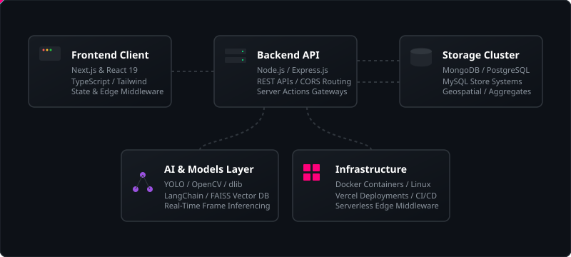

<!--
========================================================================
🔥 MONSTER GITHUB PROFILE README (UPDATED)
👤 ENGINEER: Prakhar Shukla
🚀 ROLES: Full Stack Developer | AI Engineer | Software Engineer | Problem Solver
📅 LAST UPDATED: June 2026
========================================================================
Designed with ultra-premium typography, interactive elements, custom SVG banner animations,
Mermaid architecture maps, dynamic progress bar matrices, and high-impact layouts.
========================================================================
-->

  

  
  
  
  

---

# 🚀 Executive Brief

An ambitious **Full Stack & AI Engineer** bridging the gap between rigorous algorithmic problem solving and production-grade software architectures. Currently pursuing a **B.Tech in Computer Science & Engineering**, I architect responsive user interfaces, robust distributed backends, and context-aware Artificial Intelligence systems. 

Driven by a **Product Builder mindset** and a **Startup Founder mentality**, my focus is on engineering software that scales gracefully under heavy traffic, minimizes operational latency, and unlocks tangible business value.

### Key Focus Areas
*   **System Architecture:** Developing decoupled services and scalable schemas.
*   **AI Integration:** Building production RAG (Retrieval-Augmented Generation) systems, vector searches, and custom computer vision pipelines.
*   **Performance Optimization:** Refining rendering logic, API round-trip times, and database indexes.
*   **Problem Solving:** Applying deep mathematical and data-structure principles to algorithmic bottlenecks.

---

# 🎯 Current Technological Focus (2026)

Currently deep-diving into production RAG pipelines and enterprise-grade microservice configurations. Here is a breakdown of what I am actively working on:

- **AI-Powered Applications:** Fine-tuning LLMs, building specialized agents, and integrating cognitive workflows into SaaS products.
- **Generative AI & RAG Architectures:** Optimizing retrieval latency with vector indexes, context-window compression, and hybrid search mechanisms.
- **Scalable Backends:** Transitioning monolithic backends into event-driven message architectures to optimize system throughput.
- **System Design & Patterns:** Researching distributed consensus algorithms, CQRS patterns, and horizontal database sharding.
- **Open Source Contributions:** Patching developer tools and sharing templates for Next.js AI setups.
- **Data Structures & Algorithms:** Maintaining a daily regime of competitive programming to sharpen optimization intuition.

---

# 🛠️ Technology Stack & Deep-Dive Index

A curated view of tools, frameworks, and programming languages that I use to turn ideas into scalable digital products, with structural notes on how I utilize each component:

### 🌐 Frontend Engineering

  
  
  
  
  
  
  
  

*   **Next.js & React:** Leveraging Server-Side Rendering (SSR) and Incremental Static Regeneration (ISR) to build highly optimized storefronts and dashboards. Utilizing advanced React paradigms including context providers, custom hooks (`useMemo`, `useCallback`), and code-splitting lazy loaders to minimize critical bundle sizes.
*   **TypeScript:** Enforcing strict type configurations, mapped types, abstract interfaces, and generics to prevent runtime issues and maintain a self-documenting workflow.
*   **Tailwind CSS & Material UI:** Implementing modular UI systems with mobile-first layouts, cohesive custom dark-theme palettes, and optimized CSS transitions.

### ⚙️ Backend Engineering

  
  
  

*   **Node.js & Express:** Architecting event-driven RESTful backends using async middleware wrappers, centralized error interceptors, and strict input validation layers.
*   **REST API Standards:** Designing resource routes following uniform interface guidelines, strict HTTP status codes, structured JSON payloads, and secure CORS controls.

### 🗄️ Databases & Storage

  
  
  

*   **MongoDB:** Building dynamic, scalable databases utilizing flexible Mongoose schemas, compound indexes for fast lookups, and aggregate query frameworks to parse relational analytics.
*   **PostgreSQL & MySQL:** Configuring structured schemas, defining indexes, managing migrations, and writing optimized join statements to handle transactional workflows.

### 🤖 Artificial Intelligence & Computer Vision

  
  
  
  
  
  
  
  
  

*   **Computer Vision (YOLO / OpenCV):** Implementing custom object detection frameworks. Writing multi-threaded frame processing loops in Python to process streams with sub-20ms frame latencies.
*   **Generative AI & RAG (LangChain / FAISS):** Constructing intelligent query pipelines. Splitting raw documents with recursive character text splitters, converting text chunks to vector embeddings using OpenAI APIs, and indexing vectors in FAISS for semantically-driven contextual retrieval.

### 🛠️ DevOps, Infrastructure & Tools

  
  
  
  
  
  
  

*   **CI/CD & Containers (Docker / Vercel):** Developing multi-stage Dockerfiles to reduce production image sizes. Deploying dynamic Next.js interfaces directly to Vercel's global edge network.
*   **Development Tools:** Managing complex project versions using git branch patterns, checking APIs with structured Postman collections, and using Linux bash environments.

### 📈 Core Capability Levels

  

---

# 🏗️ Full-Stack System Architecture

Below is a structured flow showing how I typically map out modern full-stack web platforms. This diagram illustrates separation of concerns across a standard client-server-database-model lifecycle.

  

---

# 🚀 Featured Project Showcase

A collection of selected applications displaying architectural decisions, technology integration, and real-world business impacts.

<table width="100%">
  <!-- Project 1: Nexora AI -->
  <tr>
    <td valign="top">
      <h3>🚀 Nexora AI — AI-Powered E-Commerce Operating System</h3>
      
Nexora AI bridges the gap between traditional retail and machine-guided insights, offering a suite of intelligent automation features.

      

        
        
        
        
      

      <ul>
        <li><b>Predictive Engine:</b> Personalizes listings using neural collaborative filtering algorithms to match customer historical profiles.</li>
        <li><b>Semantic Search:</b> Implements high-dimensional vector embeddings, mapping user query text to vector coordinates to match inventory semantic tags.</li>
        <li><b>AI Assistant:</b> Embedded chatbot utilizing system prompting and streaming APIs to guide users through checkout flows.</li>
        <li><b>Real-Time Analytics:</b> Monitors store performance and compiles stock summaries through interactive charting components.</li>
      </ul>
      

        
<b>🛠️ System Stack details</b>

        <ul>
          <li><b>Routing:</b> Next.js App Directory structure using Server Actions.</li>
          <li><b>Visual Charts:</b> Recharts library rendering SVG charts.</li>
          <li><b>Client State:</b> React Context API coupled with local storage synchronization.</li>
          <li><b>Security:</b> Strict middleware authorization limits.</li>
        </ul>
      

      
💡 <i>Business Impact: Boosts user conversion rates and automates shop administration.</i>

    </td>
  </tr>
  
  <!-- Project 2: People Counting System -->
  <tr>
    <td valign="top">
      <h3>🤖 People Counting System — AI-Powered Crowd Monitoring Platform</h3>
      
An enterprise-grade real-time security tool capable of object classification and localized crowd density estimation.

      

        
        
        
        
      

      <ul>
        <li><b>Real-Time Parsing:</b> Runs YOLO deep convolutional networks to identify human targets with sub-20ms latency.</li>
        <li><b>Tracking Logic:</b> OpenCV centroid trackers assign continuous IDs to moving bodies to calculate intersection vectors.</li>
        <li><b>Security Alerting:</b> Integrated event triggers dispatch boundary notifications when occupancy safety thresholds are breached.</li>
        <li><b>Telemetry Logs:</b> Aggregates directional data, showing flow metrics in the Flask administrative panel.</li>
      </ul>
      

        
<b>🛠️ System Stack details</b>

        <ul>
          <li><b>Core Model:</b> Ultralytics YOLO inference configurations.</li>
          <li><b>API Gateway:</b> Flask micro-framework routing frame coordinates.</li>
          <li><b>Rendering:</b> Dynamic HTML5 Canvas rendering overlaid bounding boxes on browser interfaces.</li>
          <li><b>Threading:</b> Isolated background daemon processes running parallel video stream ingest.</li>
        </ul>
      

      
💡 <i>Business Impact: Improves crowd safety protocols and automated resource allocation.</i>

    </td>
  </tr>

  <!-- Project 3: AI Face Recognition Attendance System -->
  <tr>
    <td valign="top">
      <h3>👁️ AI Face Recognition Attendance System — Intelligent Identity Management</h3>
      
An automated checking system using high-dimension facial embeddings to record check-ins with fraud prevention.

      

        
        
        
      

      <ul>
        <li><b>Detection Pipeline:</b> Employs HOG (Histogram of Oriented Gradients) filter algorithms to isolate faces in camera streams.</li>
        <li><b>Embedding Maps:</b> Generates 128-dimensional vector models representing structural keypoints of identified faces.</li>
        <li><b>Anti-Spoofing:</b> Monitors micro-expressions and eye blink movements.</li>
        <li><b>Reporting Engine:</b> Matches vectors against database profiles, auto-updating employee rosters in SQL tables.</li>
      </ul>
      

        
<b>🛠️ System Stack details</b>

        <ul>
          <li><b>Recognition:</b> dlib face recognition models configured with custom thresholds.</li>
          <li><b>Data Storage:</b> MySQL schemas maintaining transactional log lists.</li>
          <li><b>Anti-Spoofing:</b> OpenCV Haar cascades monitoring secondary biometric indicators.</li>
          <li><b>Verification:</b> Euclidean distance comparison thresholds ($D < 0.6$).</li>
        </ul>
      

      
💡 <i>Business Impact: Eliminates time-theft, reduces entry delays, and automates tracking.</i>

    </td>
  </tr>
</table>

---

# 🎓 Technical Mastery Highlights

*   **Java:** Proficient in multithreaded structures, OOP principles, execution pools, garbage collection architectures, and functional patterns (Streams & Lambdas).
*   **Python:** Expert in data processing frameworks (NumPy, Pandas), AI integration frameworks (LangChain, PyTorch, OpenCV), and fast backend gateways (Flask, FastAPI).
*   **TypeScript & JavaScript:** Focused on asynchronous micro-tasks, event loops, typed API validation contracts, and performance rendering optimization.
*   **SQL:** Experienced in query parsing plans, database optimization indexes, schema normalizing, and connection pools.

---

# 📊 GitHub Analytics & Interactive Metrics

I track code commits, streak lengths, and language metrics to monitor continuous growth and system exposure.

<table width="100%">
  <tr>
    <td width="50%" align="center">
      
    </td>
    <td width="50%" align="center">
      
    </td>
  </tr>
  <tr>
    <td colspan="2" align="center">
      
    </td>
  </tr>
  <tr>
    <td colspan="2" align="center">
      
    </td>
  </tr>
  <tr>
    <td colspan="2" align="center">
      
    </td>
  </tr>
</table>

---

# 🤝 Open Source Philosophy & Community Collaboration

Open source is the cornerstone of rapid, shared technological growth. Developing transparently keeps code clean, exposes vulnerabilities early, and allows engineers globally to construct solutions on top of modular blocks.

*   **Continuous Engagement:** Reviewing pull requests, optimizing dependencies, and submitting comprehensive bug diagnostics.
*   **Documentation Rigor:** Assisting platforms by creating comprehensive, multi-step tutorials and developer templates.
*   **Decoupled Tools:** Designing open libraries to solve recurring engineering tasks, ensuring code can be safely shared across boundaries.

---

# 🧮 Competitive Programming & Algorithmic Portals

I practice data structures and algorithms regularly to train logical thinking and maintain runtime-sensitive programming reflexes.

<table width="100%">
  <tr>
    <td width="25%" align="center">
      <a href="https://leetcode.com/Iamprakharshukla/">
         
        LeetCode Portal
      </a>
    </td>
    <td width="25%" align="center">
      <a href="https://www.geeksforgeeks.org/user/prakharshukla297/">
         
        GeeksforGeeks
      </a>
    </td>
    <td width="25%" align="center">
      <a href="https://www.codechef.com/users/prakhar_2907">
         
        CodeChef Portal
      </a>
    </td>
    <td width="25%" align="center">
      <a href="https://www.hackerrank.com/prakharshukla297">
         
        HackerRank
      </a>
    </td>
  </tr>
</table>

---

# 🏆 Professional Milestone Cards

A summary of accomplishments highlighting technical versatility and execution focus.

<table width="100%">
  <tr>
    <td width="33%" valign="top">
      <h4>⚡ Full Stack Architect</h4>
      
Designed and deployed end-to-end cloud platforms including Nexora AI. Experienced in React/Next.js and Express databases.

    </td>
    <td width="33%" valign="top">
      <h4>🤖 AI Specialist</h4>
      
Constructed real-time visual tracking platforms using YOLO models, reducing latency below 20ms and automating human density mapping.

    </td>
    <td width="33%" valign="top">
      <h4>🛠️ Open Source Contributor</h4>
      
Maintained utility templates, proposed optimization patches, and assisted developers in setting up boilerplate AI projects.

    </td>
  </tr>
  <tr>
    <td width="33%" valign="top">
      <h4>📦 Product Delivery</h4>
      
Maintained a complete build pipeline from architectural sketches, UI wireframes, backend routing, database indexing, to Vercel/Docker deployment.

    </td>
    <td width="33%" valign="top">
      <h4>🎯 Problem Solver</h4>
      
Solved hundreds of competitive algorithmic queries across LeetCode, CodeChef, and HackerRank, keeping runtime and spatial structures optimal.

    </td>
    <td width="33%" valign="top">
      <h4>🎓 CS Academic</h4>
      
Applying computer science paradigms (Operating Systems, DBMS structures, and System Design patterns) directly into practical application stacks.

    </td>
  </tr>
</table>

---

# 💡 Interesting Developer Facts

*   ☕ I convert specialty coffee beans into clean, high-performance APIs.
*   🧠 I read open-source library core structures at 2 AM to understand production patterns.
*   🛠️ Translating abstract startup concepts into working local prototypes is my favorite weekend project.
*   📚 I view reading comprehensive system manuals and API reference guides as a form of active meditation.
*   🚀 I am constantly looking for repetitive manual tasks to automate with Python scripts.

---

# 💬 Tech Quote of the Month

> [!NOTE]
> "Great software is not built by writing more code; it is built by solving the right problems."
> — *Modern Engineering Principle*

---

# 📇 Connect & Collaborate

I am always open to exploring technical initiatives, open-source challenges, startup whiteboarding, and freelance contracts.

*   **Collaboration:** Reach out if you are building AI SaaS solutions or robust distributed systems.
*   **Freelance Consultation:** Available for application audits, performance tuning, and frontend integrations.
*   **Startup Conversations:** Let's discuss system feasibility, scalability constraints, and rapid prototyping.
*   **Open Source:** Mention me in issues requiring Python/TypeScript refactoring or algorithmic support.

  
  
  
  

---

# ☕ Support My Journey

If my open-source frameworks, code modules, or project architectures have helped you save time or optimize a product, consider sponsoring my efforts:

  

---

  Thank you for visiting my developer profile. Let's build something exceptional together! 🚀 
  <b>Prakhar Shukla © 2026</b>

